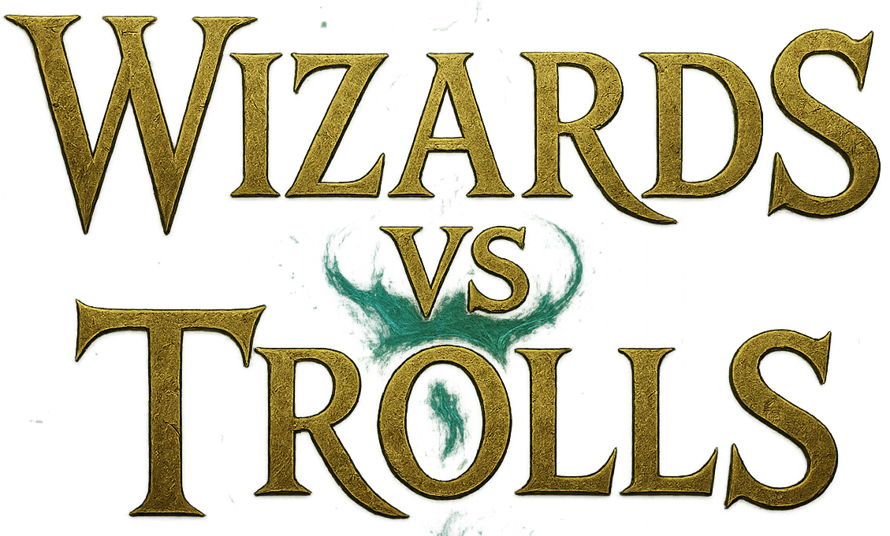

  

{: .fs-9 }

Implementazione, in Scala, del gioco "Wizards vs Trolls" per il corso di "Paradigmi di Programmazione e Sviluppo".
{: .fs-6 .fw-300 }

  

    
    

      [Documentazione](https://giacomofoschii.github.io/PPS-24-WvT/){: .btn .btn-primary .mb-4 .mb-md-0 .mr-2 }
      [Repository GitHub](https://github.com/giacomofoschii/PPS-24-WvT){: .btn .mb-4 .mb-md-0 }
    

  

  

    
  

