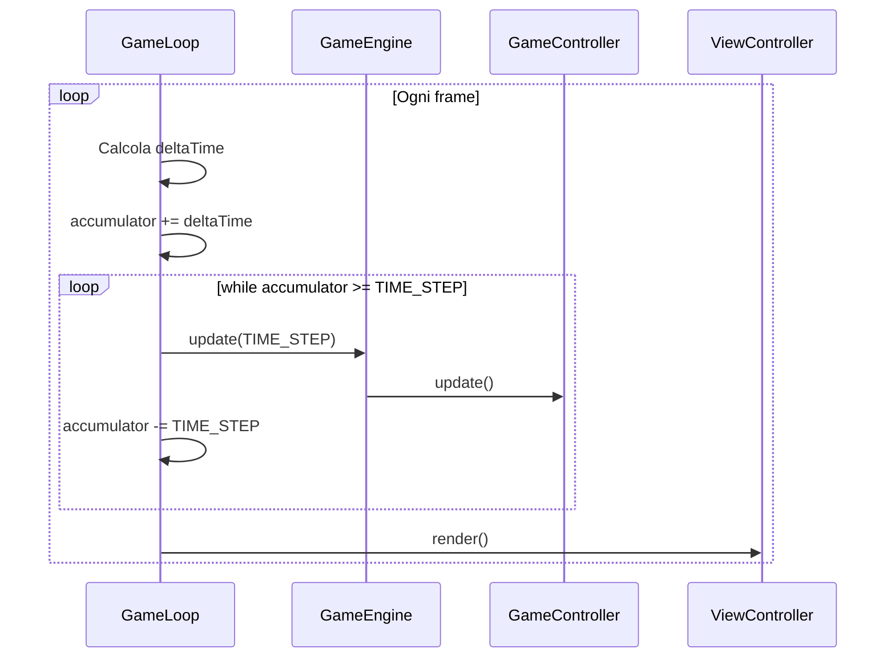
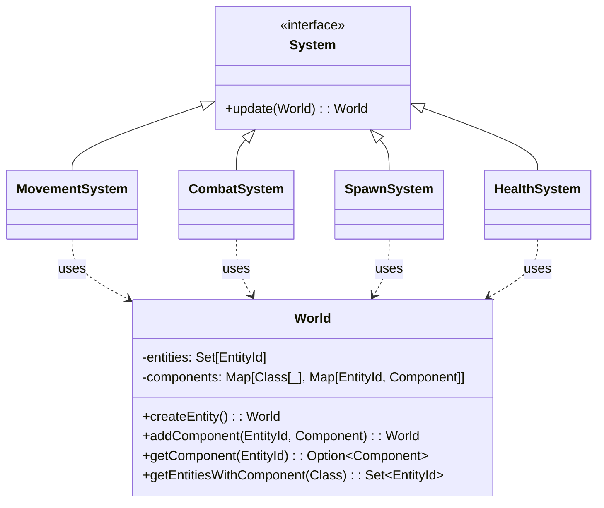
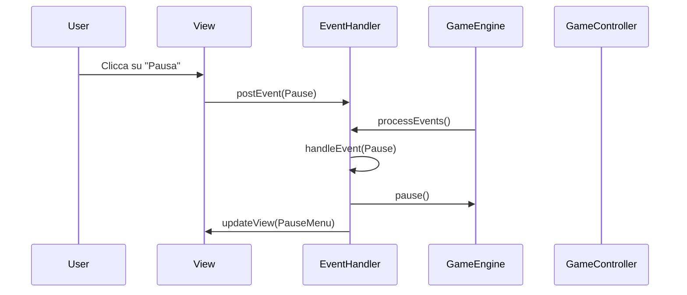

# Design di Dettaglio

---

## Panoramica

In questa sezione verrà approfondito il design delle componenti chiave del progetto, illustrando le responsabilità delle classi principali, le loro interfacce pubbliche e le interazioni che intercorrono tra di esse. L'analisi copre l'intera architettura del gioco, suddivisa nei suoi macro-componenti: il **Core Engine** che gestisce il ciclo di vita del gioco, l'architettura **Entity-Component-System (ECS)** che modella il mondo di gioco, il **Controller** che orchestra la logica e la **View** che si occupa della rappresentazione grafica.

---

## 1. Core Engine: `GameEngine` e `GameLoop`

Il cuore pulsante del gioco è costituito dal `GameEngine` e dal `GameLoop`, responsabili della gestione dello stato e del flusso temporale del gioco.

### 1.1. GameEngine

Il `GameEngine` è una macchina a stati finiti che orchestra le fasi principali del gioco: `MainMenu`, `Playing`, `Paused` e `GameOver`. Le sue responsabilità chiave sono:

* **Gestione del Ciclo di Vita**: Avvia e ferma il `GameLoop` e gestisce il ciclo di vita del `GameController`.
* **Gestione dello Stato**: Mantiene il `GameState` corrente, un record immutabile che traccia la fase di gioco (`GamePhase`), il tempo trascorso e lo stato di pausa.
* **Coordinamento degli Aggiornamenti**: Durante la fase `Playing`, invoca il metodo `update` del `GameController` per far avanzare la logica di gioco.

L'immutabilità del `GameState` è un principio cardine: ogni modifica non altera lo stato corrente, ma ne crea una nuova istanza, prevenendo effetti collaterali in un ambiente concorrente.

```scala
case class GameState(
    phase: GamePhase = GamePhase.MainMenu,
    isPaused: Boolean = false,
    elapsedTime: Long = 0L,
    fps: Int = 0
):
  def transitionTo(newPhase: GamePhase): GameState = newPhase match
    case Paused  => copy(phase = newPhase, isPaused = true)
    case Playing => copy(phase = newPhase, isPaused = false)
    case other   => copy(phase = other)
```

### 1.2. GameLoop

Per garantire un'esperienza fluida e un comportamento deterministico, è stato implementato un **game loop a timestep fisso**. Questo approccio disaccoppia la logica di gioco (updates) dalla velocità di rendering (frames), assicurando che la simulazione si comporti in modo consistente su hardware diversi.

Il `GameLoop` utilizza un `accumulator` per gestire il tempo. La logica di gioco viene aggiornata in passi discreti di tempo fisso (`FRAME_TIME_MILLIS`). Se il rendering rallenta, il loop esegue più aggiornamenti consecutivi per "recuperare" il tempo perduto, mantenendo la simulazione coerente.



## 2. Architettura ECS: Il World e i suoi Sistemi

Il **Model** del gioco è implementato secondo il pattern **Entity-Component-System (ECS)**, un'architettura *data-oriented* che favorisce la composizione e la flessibilità.

---

### 2.1. World: Il Contenitore Immutabile

Il `World` è una `case class` **immutabile** che agisce come contenitore per tutte le entità e i loro componenti. La sua immutabilità garantisce che ogni sistema operi in modo funzionale: riceve un `World` in input e restituisce un nuovo `World` modificato.

#### Interfaccia Pubblica del World:

* `createEntity()`: Restituisce un nuovo `World` con una nuova entità.
* `destroyEntity(entity: EntityId)`: Rimuove un'entità e tutti i suoi componenti.
* `addComponent[T <: Component](entity: EntityId, component: T)`: Aggiunge un componente a un'entità.
* `getComponent[T <: Component](entity: EntityId)`: Recupera un componente specifico.
* `getEntitiesWithComponent[T <: Component]`: Restituisce tutte le entità che possiedono un dato componente.

---

### 2.2. Diagramma delle Classi ECS Core



### 2.3. EntityFactory: Creazione Componibile di Entità

Per centralizzare e semplificare la creazione di entità complesse (maghi, troll, proiettili), è stata implementata una **`EntityFactory`**. Questa factory utilizza configurazioni (`WizardConfig`, `TrollConfig`) e `case class` per definire i "blueprint" delle entità.

L'`EntityFactory` astrae la logica di assemblaggio dei componenti, permettendo di creare un'entità completa con una singola chiamata di metodo (es. `EntityFactory.createFireWizard(world, position)`).

---

## 3. Controller e Gestione degli Eventi

### 3.1. GameController: L'Orchestratore

Il **`GameController`** agisce da intermediario tra il `GameEngine` (che scandisce il tempo) e i sistemi ECS (che contengono la logica). Le sue responsabilità principali sono:

* **Mantenere lo stato dei Sistemi**: Incapsula lo stato di tutti i sistemi di gioco in una `case class` `GameSystemsState`.
* **Eseguire la Pipeline dei Sistemi**: Nel suo metodo `update`, invoca i sistemi in un ordine predefinito e rigoroso per garantire la coerenza logica. Ad esempio, il movimento viene eseguito prima delle collisioni.
* **Gestire Azioni del Giocatore**: Traduce gli input dell'utente (ricevuti dalla View tramite eventi) in operazioni sul `World`, come il posizionamento di un mago.

```scala
// in GameSystemsState.scala
def updateAll(world: World): (World, GameSystemsState) =
    val (world1, updatedElixir)    = elixir.update(world)
    val (world2, updatedMovement)  = movement.update(world1)
    val (world3, updatedCombat)    = combat.update(world2)
    val (world4, updatedCollision) = collision.update(world3)
    val (world5, updatedHealth)    = health.update(world4)
    // ... continua per gli altri sistemi
```

### 3.2. EventHandler: Comunicazione Disaccoppiata

Per disaccoppiare i componenti del sistema (Engine, Controller, View), è stato implementato un sistema di gestione degli eventi.

* **`GameEvent`**: Un `sealed trait` definisce tutti i possibili eventi di gioco (es. `ShowGameView`, `GridClicked`, `Pause`, `GameWon`).
* **`EventHandler`**: Un gestore centralizzato che riceve eventi da qualsiasi parte del sistema, li accoda e li processa in modo thread-safe. Funge da macchina a stati finiti, orchestrando le transizioni di fase del gioco in risposta agli eventi.

Questo design permette alla **View** di notificare un'azione dell'utente (es. click su "Pausa") senza conoscere i dettagli di come il `GameEngine` o il `GameController` la gestiranno.



## 4. Design della View

L'architettura della **View** è progettata per essere un livello di presentazione puro, disaccoppiato dalla logica di gioco.

---

### 4.1. ViewController e GameView

* **`ViewController`**: È l'entry point dell'applicazione ScalaFX e agisce come orchestratore delle scene. Gestisce una macchina a stati (`ViewState`) per mostrare la vista corretta (`MainMenu`, `GameView`, `PauseMenu`, etc.) in base allo stato del gioco notificato dall'`EventHandler`.
* **`GameView`**: È il componente che renderizza la scena di gioco principale. Utilizza uno `StackPane` per sovrapporre diversi `Pane` (livelli): uno per lo sfondo, uno per le entità, uno per i proiettili, uno per le barre della vita e uno per l'interfaccia (HUD). Espone metodi (`renderEntities`, `renderHealthBars`) che vengono invocati dal `RenderSystem` (tramite il `ViewController`) per aggiornare la grafica.

---

### 4.2. Factory per la UI: ImageFactory e ButtonFactory

Per ottimizzare le risorse e standardizzare l'aspetto grafico, sono state implementate due factory:

* **`ImageFactory`**: Centralizza il caricamento delle immagini e implementa un sistema di **caching** per evitare di ricaricare più volte la stessa risorsa dal disco.
* **`ButtonFactory`**: Utilizza `case class` di configurazione (`ButtonConfig`) e `Presets` per creare bottoni con uno stile coerente in tutta l'applicazione, associando direttamente un'azione (`ButtonAction`) che viene tradotta in un `GameEvent`.

---

## 5. Sistemi di Gioco Principali

### 5.1. SpawnSystem: Generazione Procedurale dei Nemici

Questo sistema gestisce la comparsa dei troll.

* **Attivazione**: Si attiva solo dopo che il giocatore ha posizionato il primo mago.
* **Difficoltà Progressiva**: Aumenta le statistiche dei troll (`WaveLevel`) e la complessità delle ondate con il passare del tempo.
* **Generazione a "Batch"**: I nemici vengono generati in piccoli gruppi a intervalli leggermente randomizzati per creare un flusso più organico e meno prevedibile.

---

### 5.2. MovementSystem: Movimento a Pixel

Questo sistema ha subito un'evoluzione da un movimento a celle a uno a pixel, per una maggiore fluidità visiva.

* **Responsabilità**: Aggiorna la `PositionComponent` di ogni entità mobile in base alla sua velocità e al `deltaTime`.
* **Strategy Pattern**: Applica diverse strategie di movimento:
    * `linearLeftMovement`: Per la maggior parte dei troll.
    * `projectileRightMovement`: Per i proiettili dei maghi.
    * `zigzagMovement`: Per il Troll Assassino, che si muove a zigzag tra due corsie per essere un bersaglio più elusivo.
* **Interazione tra Componenti**: Rallenta le entità che possiedono un `FreezedComponent`.

---

### 5.3. CombatSystem e CollisionSystem: Gestione del Combattimento

Il combattimento è gestito da due sistemi che collaborano:

* **`CombatSystem`**:
    * **Responsabilità**: Iniziare gli attacchi.
    * **Logica**: Scansiona le entità attaccanti, cerca un bersaglio valido nel raggio d'azione (`findClosestTarget`) e, se non sono in cooldown, crea un'entità proiettile.
* **`CollisionSystem`**:
    * **Responsabilità**: Rilevare e risolvere le collisioni.
    * **Logica**: Controlla la sovrapposizione di posizione tra proiettili/bersagli o entità in mischia. Quando rileva una collisione, non applica direttamente il danno, ma aggiunge un `CollisionComponent` all'entità colpita.

---

### 5.4. HealthSystem: Applicazione del Danno e Morte

Questo sistema completa il ciclo di combattimento.

* **Responsabilità**: Gestire la salute delle entità.
* **Logica**:
    1.  Cerca tutte le entità con un `CollisionComponent`.
    2.  Sottrae il danno dalla loro `HealthComponent`.
    3.  Rimuove il `CollisionComponent`.
    4.  Se la salute scende a zero, l'entità viene distrutta. Se è un troll, viene aggiunto elisir al giocatore tramite l'`ElixirSystem`.

---

### 5.5. RenderSystem: Rendering Ottimizzato

Responsabile della visualizzazione delle entità, implementa un'ottimizzazione per migliorare le performance.

* **Dirty Checking**:
    * Genera un **hash** dello stato visuale corrente (posizione e immagine di ogni entità visibile).
    * Confronta questo hash con quello dell'ultimo frame renderizzato.
    * Invoca i metodi di rendering della `GameView` **solo se i due hash sono diversi**.
* **`HealthBarRenderSystem`**: Un sotto-sistema che gestisce specificamente il rendering delle barre della vita, mostrandole solo per le entità danneggiate e aggiornandone il colore in base alla salute residua.

