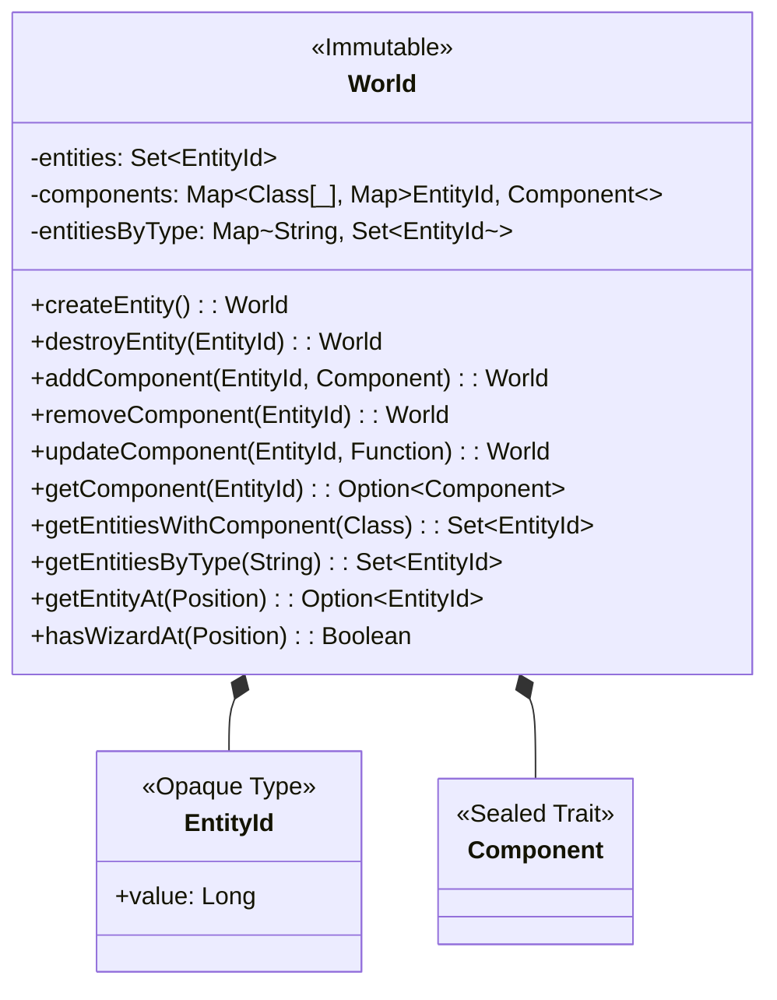
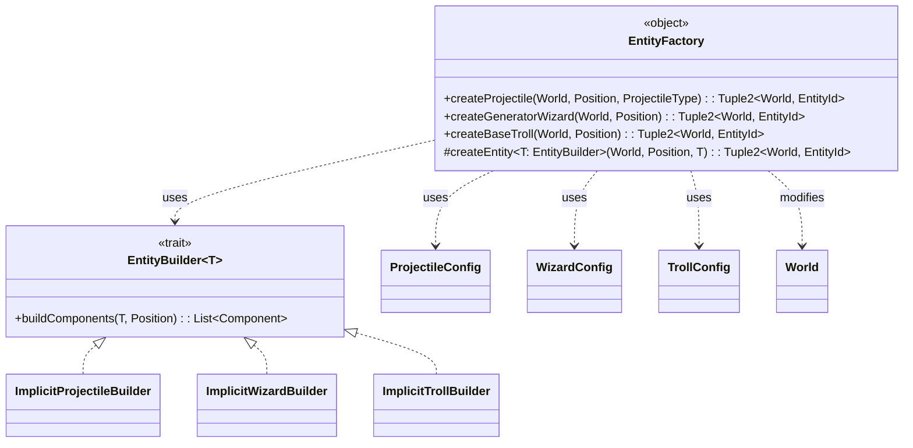
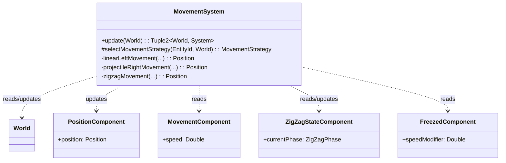
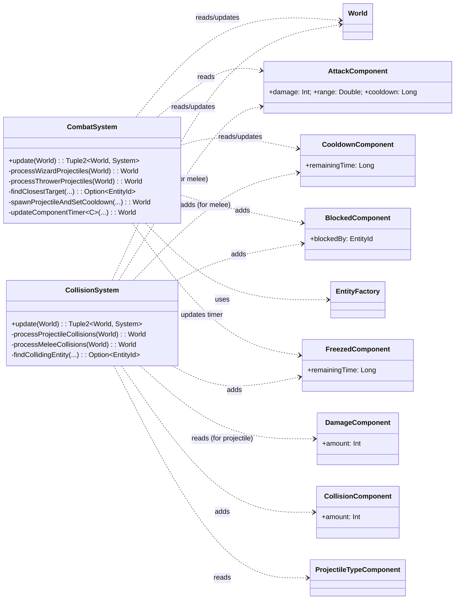
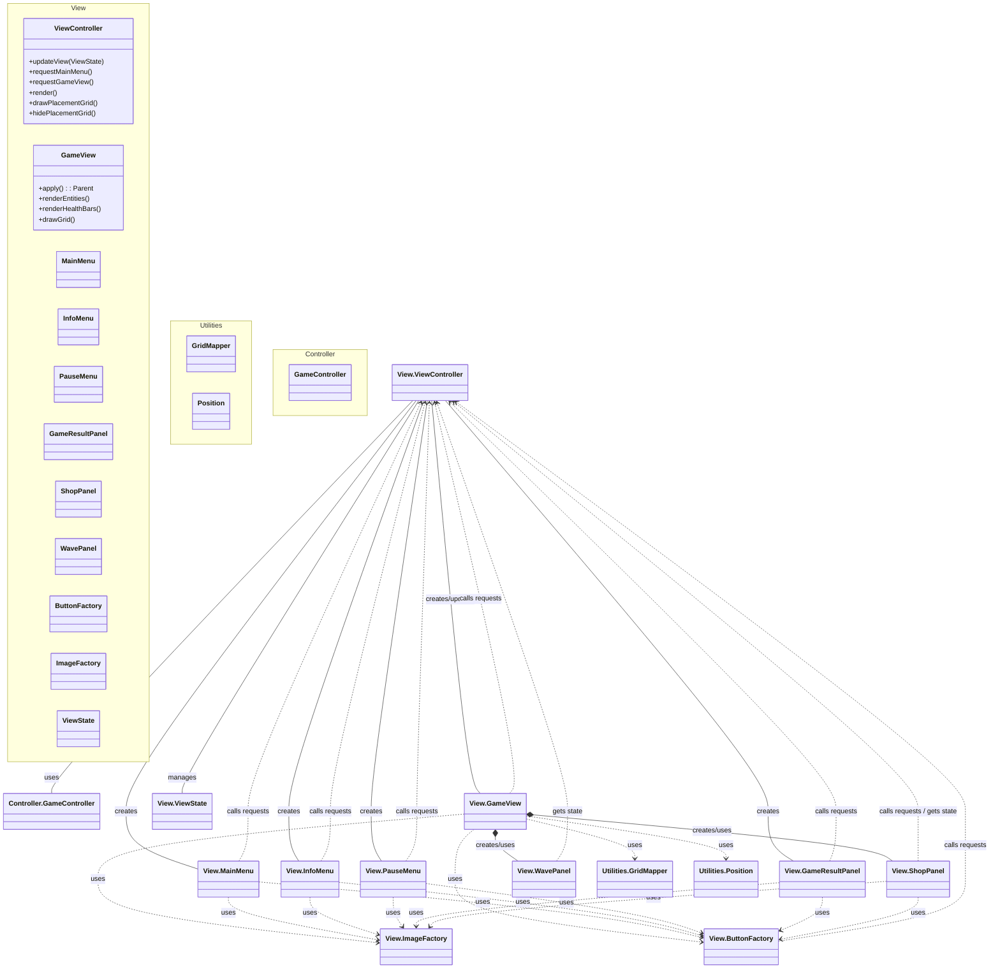
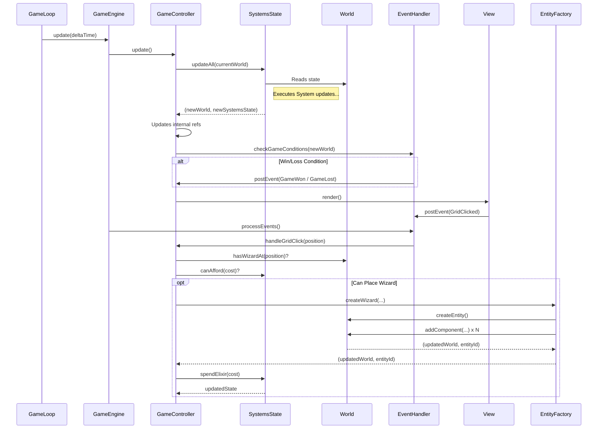

# Design di Dettaglio

---

## Panoramica

In questa sezione verrà approfondito il design delle componenti chiave del progetto *Wizards vs Trolls*, illustrando le principali responsabilità funzionali, le scelte implementative e le interazioni tra i moduli. L'analisi segue il pattern **Model-View-Controller (MVC)**, con un focus sull'implementazione del **Model** tramite l'architettura **Entity-Component-System (ECS)**, ispirandosi alla struttura descrittiva vista nel documento di esempio.

---

## Model (ECS)

Il Model racchiude e gestisce l'intera logica di business del gioco, implementata tramite il pattern **Entity Component System (ECS)**. Di seguito sono riportate le principali scelte di design e responsabilità.

### Gestione dello Stato del Mondo (`World`)

Il nucleo del Model è rappresentato dal `World`, una `case class` **immutabile** che funge da contenitore centrale per tutte le entità e i loro componenti. L'immutabilità garantisce che ogni operazione (eseguita dai `System`) restituisca un nuovo stato del mondo senza modificare quello precedente, aderendo ai principi funzionali e semplificando la gestione dello stato in un ambiente potenzialmente concorrente.

* **Responsabilità**:
    * Mantenere l'insieme di tutte le entità attive (`EntityId`).
    * Mappare i tipi di componenti alle entità che li possiedono (`Map[Class[_], Map[EntityId, Component]]`).
    * Fornire API funzionali per creare/distruggere entità e aggiungere/rimuovere/aggiornare/recuperare componenti (es. `createEntity()`, `addComponent()`, `getComponent()`, `getEntitiesWithComponent()`).
    * Permettere query specifiche sullo stato (es. `getEntitiesByType()`, `getEntityAt()`, `hasWizardAt()`).

### Creazione delle Entità (EntityFactory)

La creazione delle diverse entità del gioco (Maghi, Troll, Proiettili) è centralizzata nell'object **`EntityFactory`**. Questo approccio utilizza il pattern **Factory Method** combinato con **Type Classes** (`EntityBuilder`) per assemblare le entità in modo componibile e type-safe.

* **Responsabilità**:
  * Definire **configurazioni** (`WizardConfig`, `TrollConfig`, `ProjectileConfig`) che descrivono le proprietà base di ciascun tipo di entità.
  * Utilizzare `EntityBuilder` (implementati tramite `given instances`) per costruire la lista di `Component` necessari per ogni configurazione.
  * Fornire **metodi specifici** (es. `createFireWizard`, `createBaseTroll`, `createProjectile`) che prendono il `World` corrente, la posizione e il tipo di entità, restituendo il `World` aggiornato con la nuova entità e il suo `EntityId`.
  * Astrarre i dettagli dell'aggiunta dei singoli componenti al `World`.

### Logica di Gioco (Systems)

Tutta la logica comportamentale è incapsulata nei **`System`**. Ogni `System` è una `case class` (solitamente stateless) che implementa il trait `System`, definendo un metodo `update(world: World): (World, System)`. Questo metodo prende lo stato attuale del mondo e restituisce il nuovo stato modificato e, potenzialmente, una nuova istanza del sistema (anche se spesso restituisce `this` essendo stateless).

---

#### Strategie di Movimento (MovementSystem)

Questo sistema gestisce lo spostamento di tutte le entità mobili.

* **Responsabilità**:
  * Aggiornare la `PositionComponent` delle entità in base alla loro `MovementComponent` e al `deltaTime`.
  * Applicare diverse **strategie di movimento** in base al tipo di entità (tramite pattern matching sull' `EntityTypeComponent`):
      * Movimento lineare a sinistra per i Troll (`linearLeftMovement`).
      * Movimento lineare a destra per i Proiettili dei Maghi (`projectileRightMovement`).
      * Movimento lineare a sinistra per i Proiettili dei Troll.
      * Movimento a zigzag per i Troll Assassini (`zigzagMovement`), gestito tramite lo `ZigZagStateComponent` per mantenere lo stato specifico dell'entità.
  * Considerare gli effetti di stato come il rallentamento (`FreezedComponent`).
  * Rimuovere i proiettili che escono dai limiti dello schermo.

### Gestione del Combattimento e Collisioni (CombatSystem, CollisionSystem)

Il combattimento è diviso in due fasi gestite da sistemi distinti:

#### CombatSystem:
* **Responsabilità**: Iniziare gli attacchi a distanza.
* **Logica**: Identifica le entità attaccanti (Maghi, Troll Lanciatori), cerca bersagli nel raggio d'azione (`findClosestTarget`), verifica il cooldown (`CooldownComponent`) e, se possibile, crea un'entità `Projectile` usando `EntityFactory` e imposta il cooldown sull'attaccante. Gestisce anche la logica di blocco (`BlockedComponent`) per i Troll Lanciatori. Aggiorna i timer dei `CooldownComponent` e `FreezedComponent`.

#### CollisionSystem:
* **Responsabilità**: Rilevare e risolvere le collisioni fisiche.
* **Logica**:
    * **Proiettili**: Verifica se la cella di un proiettile coincide con quella di un bersaglio valido. Se sì, distrugge il proiettile e aggiunge un `CollisionComponent` (con il danno) al bersaglio. Applica l'effetto `FreezedComponent` se il proiettile era di ghiaccio.
    * **Mischia**: Verifica se un Troll (non Lanciatore) è nella stessa cella di un Mago. Se sì, aggiunge un `BlockedComponent` al Troll, e se non è in cooldown, aggiunge un `CollisionComponent` al Mago e imposta il cooldown sul Troll.

### Generazione Nemici (SpawnSystem)

Questo sistema gestisce l'apparizione dei Troll sulla mappa.

* **Responsabilità**:
  * Schedulare e generare ondate di Troll (`SpawnEvent`).
  * Attivarsi solo dopo il posizionamento del primo Mago.
  * Incrementare la difficoltà (`WaveLevel`) aumentando numero, tipo e statistiche dei Troll generati.
  * Generare Troll in "batch" a intervalli variabili per un flusso meno prevedibile.
  * Applicare lo scaling delle statistiche ai Troll creati in base all'ondata corrente.
  * Gestire la pausa del gioco sospendendo e riprendendo correttamente la generazione.

---

### Gestione Risorse ed Effetti (ElixirSystem, HealthSystem)

#### ElixirSystem:
* **Responsabilità**: Gestire la risorsa Elixir del giocatore.
* **Logica**: Traccia l'ammontare corrente (`totalElixir`), gestisce la generazione periodica automatica e quella dei Maghi Generatori (interagendo con `CooldownComponent`), permette di spendere (`spendElixir`) e aggiungere (`addElixir`) elisir, rispettando il cap massimo (`MAX_ELIXIR`).

#### HealthSystem:
* **Responsabilità**: Gestire la salute delle entità e le conseguenze del danno.
* **Logica**: Processa i `CollisionComponent` aggiunti dal `CollisionSystem`, sottrae la salute dalla `HealthComponent`, rimuove il `CollisionComponent`. Se la salute scende a zero:
    * Marca l'entità per la rimozione.
    * Se è un Troll, comunica all'`ElixirSystem` di aggiungere la ricompensa.
    * Rimuove fisicamente le entità marcate dal `World` (`destroyEntity`).
    * Gestisce la rimozione a cascata dei `BlockedComponent` quando l'entità bloccante muore.

## View

La **View** si occupa della presentazione grafica dello stato del gioco e dell'interazione diretta con l'utente, utilizzando **ScalaFX**.

---

### Gestione delle Schermate

* **Responsabilità**: Mostrare la schermata appropriata (Menu Principale, Gioco, Info, Pausa, Vittoria, Sconfitta) in base allo stato dell'applicazione.
* **Componenti**:
    * `ViewController`: Gestisce le transizioni tra stati (`ViewState`) e aggiorna la `Scene` della `PrimaryStage`.
    * `MainMenu`, `InfoMenu`, `PauseMenu`, `GameResultPanel`: `object` che definiscono la struttura e i controlli di ciascuna schermata statica.

---

### Rendering della Scena di Gioco

* **Responsabilità**: Disegnare lo stato corrente del `World` a schermo.
* **Componenti**:
    * `GameView`: Organizza i diversi livelli grafici (`Pane` sovrapposti) e fornisce metodi (`renderEntities`, `renderHealthBars`, `drawGrid`) per aggiornare specifici livelli. Utilizza `Platform.runLater` per garantire che gli aggiornamenti avvengano sul thread UI. Gestisce i click sulla griglia.
    * `RenderSystem` (nel Model, guida la View): Determina cosa deve essere disegnato.
    * `HealthBarRenderSystem` (nel Model, guida la View): Sottosistema specializzato per calcolare quali barre della vita mostrare.
    * `GridMapper`: Utility `object` utilizzato da `GameView` per convertire le coordinate fisiche (click del mouse) in logiche (cella della griglia) e viceversa, per disegnare la griglia (`drawGrid`) e posizionare le entità (`renderEntities`).
    * `Position`: `case class` che rappresenta le coordinate fisiche (pixel), utilizzata da `GameView` per posizionare gli elementi grafici.

---

### Creazione Componenti UI

* **Responsabilità**: Standardizzare la creazione e l'aspetto degli elementi UI riutilizzabili, simile ai factory pattern visti nell'esempio.
* **Componenti**:
    * `ButtonFactory`: Crea bottoni (`Button`) con stili predefiniti (Presets basati su `ButtonConfig`) e associa direttamente `ButtonAction` che vengono tradotte in `GameEvent`.
    * `ImageFactory`: Carica e gestisce `ImageView`, implementando un sistema di caching per ottimizzare l'uso della memoria e i tempi di caricamento.
    * `ShopPanel`, `WavePanel`: Creano e gestiscono i pannelli specifici dell'HUD (negozio e informazioni sull'ondata).

## Controller

Il **Controller** agisce come collante, orchestrando il flusso di dati e la logica applicativa tra il Model e la View.

---

### Orchestrazione del Flusso di Gioco

* **Responsabilità**: Far avanzare lo stato del gioco nel tempo e coordinare l'esecuzione della logica.
* **Componenti**:
    * `GameController`: Riceve l'impulso (`update()`) dal `GameEngine` (tramite il `GameLoop`). Mantiene lo stato corrente dei sistemi (`GameSystemsState`). Chiama il metodo `updateAll()` di `GameSystemsState` per eseguire la pipeline dei sistemi ECS nell'ordine corretto. Gestisce le azioni del giocatore ricevute come `GameEvent` dall'`EventHandler`.
    * `GameSystemsState`: Raggruppa tutti i sistemi ECS e definisce l'ordine di update. Contiene anche metodi per verificare le condizioni di fine partita (`checkWinCondition`, `checkLoseCondition`).
    * `GameEngine` / `GameLoop`: (Esterni al Controller ma lo invocano) Forniscono il "battito cardiaco" del gioco, garantendo che `GameController.update()` sia chiamato a intervalli regolari (timestep fisso).

---

### Gestione degli Eventi

* **Responsabilità**: Disaccoppiare i componenti e gestire la comunicazione e le transizioni di stato in modo centralizzato.
* **Componenti**:
    * `EventHandler`: Mantiene una coda thread-safe (`EventQueue`) di `GameEvent`. Riceve eventi da View (input utente), `GameEngine` (cambiamenti di stato globali), `GameController` (condizioni di gioco). Processa gli eventi in base alla loro priorità, invocando handler registrati o gestendo direttamente le transizioni di stato del `GameEngine` e della `ViewController` (es. passaggio da `Playing` a `Paused`).
    * `GameEvent`: ADT (`sealed trait`) che definisce tutti i tipi di eventi possibili, con una priorità associata.

---

### Gestione dell'Input

* **Responsabilità**: Validare e interpretare l'input grezzo dell'utente.
* **Componenti**:
    * `InputSystem`: Riceve le coordinate grezze del mouse click dalla `GameView` (inoltrate tramite `ViewController` e `GameController`).
    * `InputProcessor`: Contiene la logica per verificare se un click (`MouseClick`) ricade all'interno dell'area valida della griglia (`isInGridArea`).
    * `ClickResult`: `case class` che rappresenta l'esito della validazione dell'input (posizione valida/invalida, eventuale messaggio di errore).
    * `GridMapper`: Utilizzato per convertire le coordinate fisiche (pixel) in coordinate logiche (riga/colonna) se il click è valido. L'`EventHandler` riceverà poi un `GridClicked` event con le coordinate logiche.

